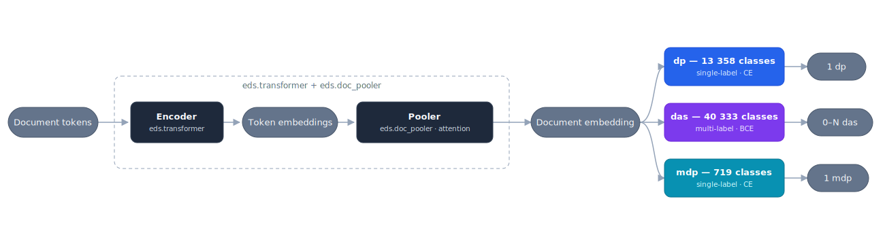

# CU2 Encoder Baseline

Encoder baseline for **document-level ICD-10 (CIM-10) coding of French clinical notes**, built
on [EDS-NLP](https://github.com/aphp/edsnlp) and a CamemBERT-style transformer. This is the
**CU2** encoder baseline of the **PARTAGES** project (CU2 = the ICD-10 diagnosis-coding use case shared
across PARTAGES partners).

Given a clinical note, the model predicts its diagnosis codes:

| Head  | Meaning                                              | Type             | Loss |
|-------|------------------------------------------------------|------------------|------|
| `dp`  | *Diagnostic principal* — the note's main diagnosis   | single-label     | CE   |
| `das` | *Diagnostics associés* — comorbidities | multi-label      | BCE  |
| `mdp` | *Mode de prise en charge* (defaults to `Z769`)    | single-label     | CE   |

> The **default** configuration is the multi-head setup above
> ([`configs/config.yml`](configs/config.yml)). A simpler single-head variant predicting only
> `dp` ([`configs/config_dp.yml`](configs/config_dp.yml)) is also provided as a complementary
> baseline. See [docs/training.md](docs/training.md).

This repo is **config-driven**: there is no training script in-tree. The whole pipeline,
optimizer, data and training loop are described in `configs/config.yml`, a
[confit](https://github.com/aphp/confit) config consumed by EDS-NLP's `train` / `tune` entry
points.

## Documentation

| Doc                                            | What's inside                                                        |
|------------------------------------------------|---------------------------------------------------------------------|
| [docs/data.md](docs/data.md)                   | Expected data format, label definitions, the CIM-10 referential, artifacts |
| [docs/training.md](docs/training.md)           | `config.yml` walkthrough, how to launch training and hyper-param tuning |
| [docs/inference.md](docs/inference.md)         | Loading a trained model and scoring notes                           |
| [docs/preprocessing.md](docs/preprocessing.md) | How the parquet/label inputs are built (AP-HP Spark notebooks)      |

## Model architecture

The pipeline nests, from inner to outer:

```
eds.transformer        almanach/camembertv2-base (or PARTAGES-camembert-large), sliding window of 256 tokens
      ↓
eds.doc_pooler         attention pooling → one embedding per document
      ↓
eds.doc_classifier     one classification head per label (dp / das / mdp)
```



<sub>Diagram source: [`docs/architecture.mmd`](docs/architecture.mmd) (Mermaid). Regenerate `docs/architecture.svg` after editing.</sub>

Two classifier components **share their weights** through a confit reference:
`doc_classifier` (trained on real data) and `doc_classifier_syn` (trained on synthetic
synonym data, down-weighted). The synthetic head is excluded at inference.

## Installation

Dependencies are managed with [uv](https://docs.astral.sh/uv/) (Python 3.12, see
`.python-version`).

You **must** pick a torch backend that matches your hardware via a uv *extra* — a bare
`uv sync` installs no torch:

```bash
uv sync --extra cpu      # no GPU (local / WSL dev, CI)
uv sync --extra cu118    # CUDA 11.8
uv sync --extra cu121    # CUDA 12.1 (the AP-HP training cluster)
uv sync --extra cu124    # CUDA 12.4
uv run <cmd>             # run anything inside the project venv
```

**Which one do I pick?** If your machine has **no NVIDIA GPU**, use `cpu`. Otherwise run
`nvidia-smi` and read the **"CUDA Version"** shown top-right: choose the **highest `cuXXX` that
is not above** it (a GPU build also runs on any newer CUDA driver). Examples: CUDA 12.1 or
12.2 → `cu121`; CUDA 12.4 or newer (incl. 13.x) → `cu124`; CUDA 11.8 to 12.0 → `cu118`. When
unsure, `cu121` is a safe default on most recent GPUs.

Notes:

- **`edsnlp` is pinned to a git branch** (`classif_head`): the `eds.doc_classifier`,
  `eds.doc_pooler` components and the `eds.doc_classif` metric only exist on that fork.
- **torch is portable via conflicting extras** (`cpu` / `cu118` / `cu121` / `cu124`).
  For a CUDA build not listed, add an index + extra in `pyproject.toml` following the
  existing pattern (see <https://pytorch.org/get-started/locally/>). If `uv sync` fails on
  torch, you almost certainly forgot the `--extra`, or need a backend not yet declared — **do
  not** rebuild the environment by hand (that silently pulls an ancient, incompatible
  `transformers`).
- The transformer `PARTAGES-camembert-large` referenced in the config may be access-restricted
  on the Hugging Face Hub. Swap it for the public `almanach/camembertv2-base` if you don't have
  access (see [docs/training.md](docs/training.md)).
- The data-preprocessing notebooks additionally need PySpark and the AP-HP-internal
  `edstoolbox`; these are **not** project dependencies (AP-HP only) — see
  [docs/preprocessing.md](docs/preprocessing.md).

## Data

The datasets are **not AP-HP-private** — they are usable by any PARTAGES partner: **MISTRAL**
(train/test) is shared on the PARTAGES Google Drive, the **synonym** augmentation is shipped in
this repo (`data/synonyms.pkl`, built from public referentials), and **PARHAF** (optional
validation) is the gated `HealthDataHub/PARHAF` dataset on Hugging Face. You can also **train on
your own clinical notes** — see [*Using your own data*](docs/training.md#using-your-own-data).
Full schema and label details are in [docs/data.md](docs/data.md).

## Quickstart

```bash
# 1. Install (pick the torch extra for your hardware: cpu / cu121 / cu124)
uv sync --extra cu121

# 2. Get the data: download MISTRAL from the PARTAGES Drive, or bring your own parquet
#    (docs/training.md#using-your-own-data). Schema: docs/data.md

# 3. Edit the absolute paths and the model name in configs/config.yml (see docs/training.md)

# 4. Train
uv run python -m edsnlp.train --config configs/config.yml --seed 42

# 5. Score the trained model (see docs/inference.md)
```

## Repository layout

```
configs/config.yml     # the single source of truth: pipeline + optimizer + data + training
data/                  # CIM-10 referential + label artifacts (.pkl) consumed by the config
scripts/               # data-preparation scripts (AP-HP Spark), factored from the notebooks
notebooks/             # original data-preparation notebooks + inference reference
docs/                  # this documentation
pyproject.toml         # dependencies (uv)
```

## Contributing

Contributions from PARTAGES partners are welcome. If you clone the repo and want to propose a
pull request, install the [pre-commit](https://pre-commit.com/) hooks once after `uv sync` so
your changes are linted and formatted automatically on every commit:

```bash
uv run pre-commit install        # register the git hook (one-time)
```

The hooks run [ruff](https://docs.astral.sh/ruff/) — the linter (with import sorting and
auto-fix) and the formatter (line length 88, double quotes; notebooks excluded). To check the
whole tree without committing:

```bash
uv run pre-commit run --all-files
```

You can also run ruff directly:

```bash
uv run ruff check .              # lint (add --fix to auto-fix)
uv run ruff format .             # format
```

Work on a **feature branch** rather than committing to `main`, then open a pull request against
`main`. Name the branch `<type>/<short-description>`, reusing the commit-type prefixes
(`feat/`, `fix/`, `docs/`, `refactor/`, `chore/`) — for example `feat/das-synthetic-head` or
`docs/architecture-diagram`.

Please make sure `pre-commit run --all-files` passes before opening a pull request.

## License

Apache License 2.0 — see [LICENSE](LICENSE).
